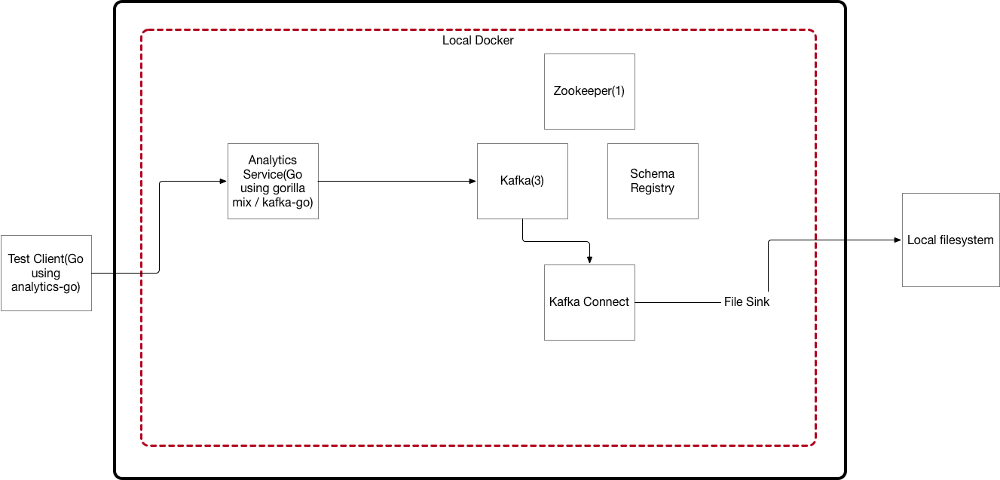

# Analytics

- The goal of this project is to allow us to do everything that segment does(minus the destinations)and to test locally.

## analytics-platform

- This contains the code to spin up docker containers for kafka(including zookeeper, kafka, schema registry, and kafka connect)
- The goal is to allow us to send data to kafka and have it write out to a file sink(local directory). We want to mimic how kinesis writes out to a firehose ends up in s3.

## analytics-service

- This contains 2 REST endpoints to allow clients to call identify and track.  It uses gorilla mux and kafka-go.

## analytics-test-client

- This contains a test go client to test sending segment events to the analytics service.  This is using the standard analytics-go segment library with a custom url to do this.

## analytics-test-website

- This will eventually contain a simple website using a hacked version of the analytics.js library to send to the analytics service.

## Version 1

