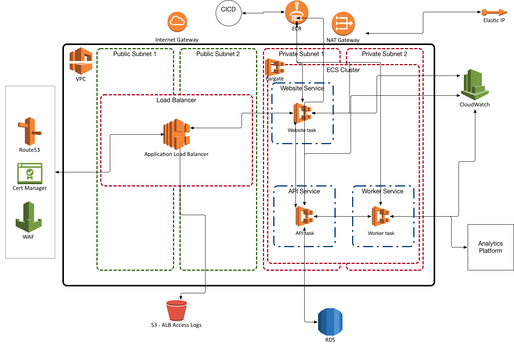

# Analytics Playground

- The goal of this project is to allow me to run tests on an analytics platform.  
- I know you can replay events and use varous other means to test an analytics platform but this project is just something I've had bouncing around in my head and I'd like to see if I can code it.
- This is a **Work In Progress**.  I know it will be an evolving playground. :)

## analytics-platform(sandbox)

- This contains the code to spin up docker containers for a somewhat typical Kafka stack(including Zookeeper, Kafka, Schema Registry, and Connect) as well as an api service that publishes to a kafka topic.

- I haven't done alot with Kafka so this is an opportunity to learn something new.

- It also contains a client that pushes events to the api so you can do some simple testing.

- So the flow is client -> api -> kafka -> kafka connect -> local file system(or S3).

## analytics-website(swing set)

- This will eventually contain a website that will allow us to test the analytics platform using many different scenarios.

## analytics-plan-runner(merry go round)

- This will contain a worker that takes the plan from the analytics website and executes it.

## analytics-reconciliation(slide)

- I know this stack completely misses the event reconciliation part of the workflow so I'm thinking about adding something that will ingest the events into postgresql and then surface some graphs(possibly via cube.js or some other visualization tool).

## Final Vision in AWS

- Analytics Platform is black boxed because in theory it could be any event aggregation platform.

- In a real world, high event volume stack, I would probably have a process that loads the events(after traveling through that black box) into a Snowflake(or other columnar database) and then use a tool like Looker(or tableau) to view the results.  I left that out of the architecture diagram.

