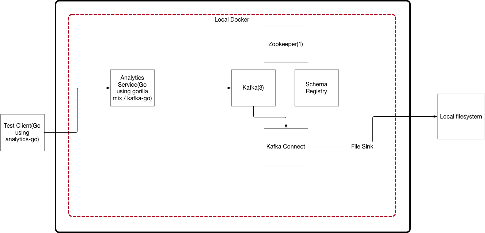
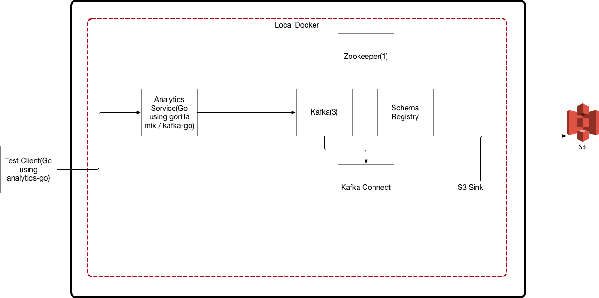

# analytics-platform

## Arch Diagrams

## Version 1 Analytics Platform

- Just the basics.



## Version 1 Arch via S3




## How to start things up

1. Go to the analytics-service directory first and build that service.
    - This is the go web service that pushes data to kafka.

2. Create a .env file in the analytics-platform directory with 2 values:

    ```bash
    ROLE=<your arn for the role you are going to assume via the ectou metadata service>
    AWS_PROFILE=<typically default but could be any profile you have setup in the credntials file>
    ```

3. Start up the stack(zookeeper, kafka, kafka connect, schema registry, and analytics service).

    ```bash
    docker-compose up -d
    ```

4. Create the mountpoint so we can see the output of the file sink.

    ```bash
    docker exec analytics-platform_kafka-connect_1 mkdir -p /tmp/quickstart/file
    ```

5. Creates the actual file the output of the file sink will go into.

    ```bash
    docker exec analytics-platform_kafka-connect_1 touch /tmp/quickstart/file/output.txt
    ```

6. Creates the file sink in kafka connect.  In practice this would be part of the container build but here we have the rest api exposed so we can tinker.

    ```bash
    curl -X POST -H "Content-Type: application/json" --data '{"name": "quickstart-file-sink", "config": {"connector.class":"FileStreamSink", "tasks.max":"1", "topics":"events", "file": "/tmp/quickstart/file/output.txt", "name": "quickstart-file-sink"}}' http://localhost:8083/connectors
    ```

7. This is used to view the status of the sink.

    ```bash
    curl -s -X GET http://localhost:8083/connectors/quickstart-file-sink/status
    ```

8. This destroys the stack(zookeeper, kafka, kafka connect, schema registry, and analytics service).

    ```bash
    docker-compose down
    ```

## How to have kafka connect send to S3 instead of the local file system

1. Run the following command(after your stack is up and running) to have kafka connect forward items in a topic to S3:

    ```bash
    curl -X POST -H "Content-Type: application/json"
    --data '{
        "name": "aws-s3-sink-no-avro",
        "config": {"name": "aws-s3-sink-no-avro",
        "connector.class": "io.confluent.connect.s3.S3SinkConnector",
        "tasks.max": "1",
        "s3.region": "us-east-1",
        "s3.bucket.name": "<your s3 bucket name>",
        "s3.part.size": "5242880",
        "flush.size": "3",
        "storage.class": "io.confluent.connect.s3.storage.S3Storage",
        "format.class": "io.confluent.connect.s3.format.avro.AvroFormat",
        "schema.generator.class": "io.confluent.connect.storage.hive.schema.DefaultSchemaGenerator",
        "partitioner.class": "io.confluent.connect.storage.partitioner.DefaultPartitioner",
        "schema.compatibility": "NONE",
        "topics": "events"}}'
        http://localhost:8083/connectors
    ```

2. This is used to view the status of the sink.

    ```bash
    curl -s -X GET http://localhost:8083/connectors/aws-s3-sink-no-avro/status
    ```

### Assumptions

- You have your AWS profile, IAM role, and credentials file location set correctly for the ectou-metadata service. Role and Profile need to be in a .env file.

- You have read this: <https://docs.confluent.io/5.3.0/connect/kafka-connect-s3/index.html#> and understand how partitioning works.  This also helps: <https://www.confluent.io/blog/apache-kafka-to-amazon-s3-exactly-once>
